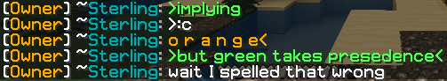

BukkitGreentext
===============

Add greentext functionality to a Bukkit/Spigot server.

### Okay but why?

I didn't find
[other greentext plugins](https://dev.bukkit.org/projects/greentext)
all that featureful, so I set out to make my own (originally just for
my own [personal server](https://www.ssterling.net/minecraft)).
My plugin supports orangetext, is permissions-based, has convenient
commands to disable or enable per-player or globally, &amp;c.&mdash;all
of which are entirely *optional* features.
And if that isn't enough, hop on over to the
[issue tracker](https://gitlab.com/ssterling/bukkitgreentext/issues)
to voice your suggestion.

Usage
-----

Download the plugin JAR from the
[Spigot project page](https://www.spigotmc.org/resources/bukkitgreentext.55295/)
and drop it in the `plugins/` directory of your Minecraft server.

Any message starting with the greater-than sign, `>`,
is made green, whilst any message *ending* with the opposite `<`
is made orange.
Players can avoid making anything starting with `>` green by
prepending a space, i.e. ` >`, or by using `/greentext [on|off]`.

### Configuration

To avoid automatic greenification of angry emotions, e.g. `>:C`,
or Japanese-style emoticons such as `>_>`, *exceptions*
for `:` and `_` are specified in the config file.
Custom exceptions are allowed as well, naturally.

Greentext can be either enabled or disabled upon startup.
In the case the parameter `enabled-on-startup` is set true,
each player must manually enable the plugin with `/greentext on`.
Additionally, orangetext, an obscure feature
[used probably once](https://www.reddit.com/r/BannedFrom4chan/comments/221co5/),
can be disabled via config.

### Permissions

If `check-for-permissions` is set true in the config file,
give players the desired permissions to enable use of the plugin:

* `greentext.chat.*`: all features
* `greentext.chat.green`: greentext
* `greentext.chat.orange`: orangetext
* `greentext.toggle`: toggle ability to use features
* `greentext.toggle.others`: toggle others' ability to use features

Notes
-----

### Why so much debug logging?

I'm really bad at Java, and I need to know what's going on
when I debug my subpar code.

### Some to-do

* Make HashMap of player toggle persistent (via YAML file?)
* Separate exceptions for orangetext and greentext
* Toggle orangetext separately from greentext
* Support for reply reference (`>>31337`) and board reference (`>>>/out/`)

Contributing
------------

Tab characters for indentation; spaces for alignment.
Just look through the code and assimilate it.
